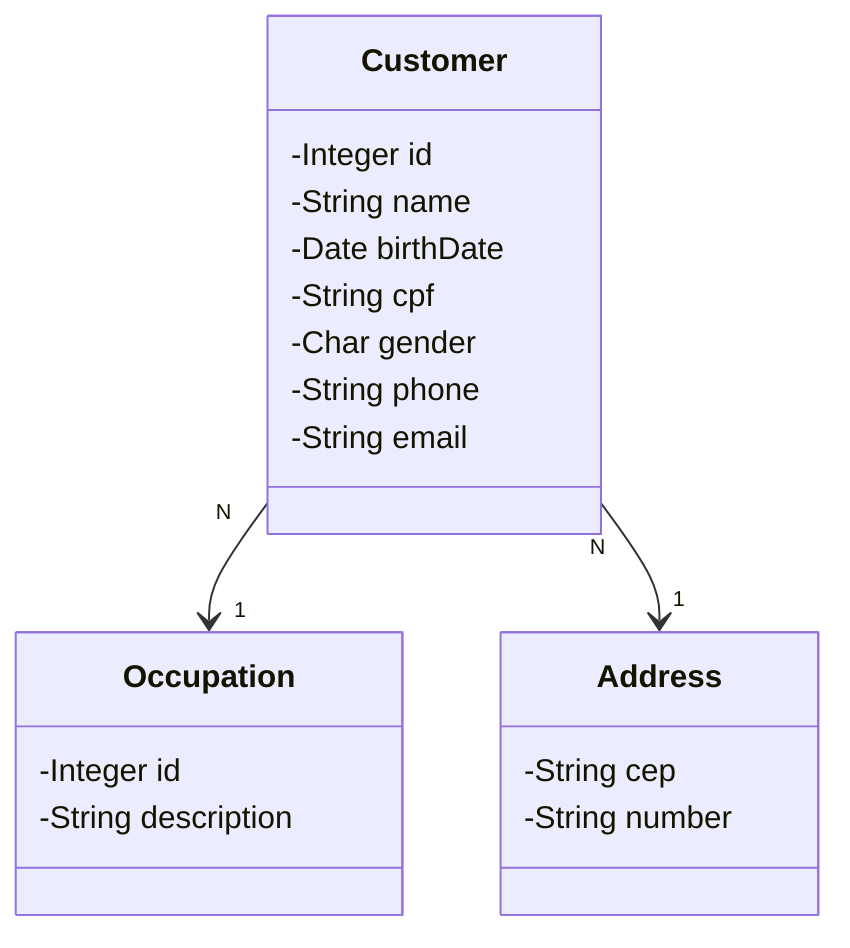

# Customers Registration
Java RESTful API para o cadastro de clientes com endereço a partir do CEP.

## Diagrama de Classes

```mermaid
classDiagram
    class Customer {
        -Integer id
        -String name
        -Date birthDate
        -String cpf
        -Char gender
        -String phone
        -String email
    }

    class Occupation {
        -Integer id
        -String description
    }

    class Address {
        -String cep
        -String number
    }

    Customer "N" --> "1" Occupation
    Customer "N" --> "1" Address
```
